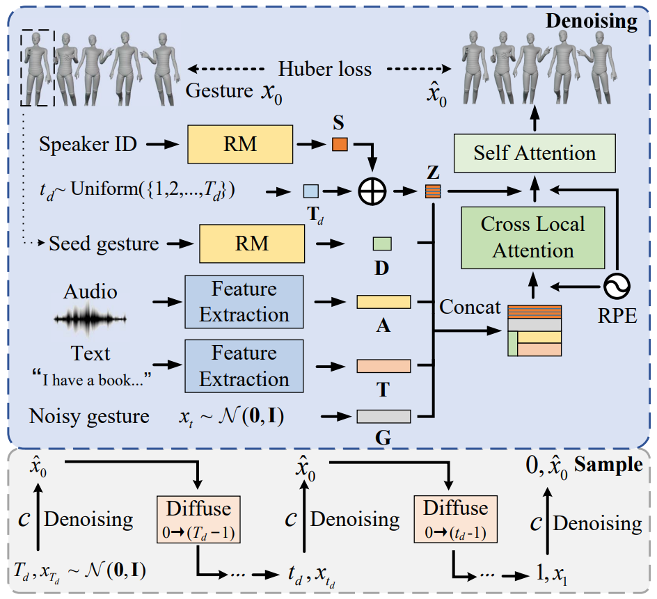

# The DiffuseStyleGesture+ entry to the GENEA Challenge 2023

### [Demo Video](https://youtu.be/CIzUjsOJ-kc) | [Arxiv](https://arxiv.org/abs/2308.13879) | [Conference archive](https://dl.acm.org/doi/10.1145/3577190.3616114) | [Poster](https://github.com/YoungSeng/DiffuseStyleGesture/blob/master/BEAT-TWH-main/icmi23_poster.pdf)


<div center>

</div>

### Updates on DiffuseStyleGesture

1. Input: add text semantics, style replaced with speaker ID, feature representation of audio and gestures
2. Model: optimized network architecture, seed gestures frames without speech
3. Code: data read by `h5` instead of `lmdb`, `lmdb` is very space-consuming; update configuration file
4. Evaluation: We submitted the system to [GENEA 2023](https://genea-workshop.github.io/2023/challenge/) to be evaluated with other models. DiffuseStyleGesture+ is competitive. We further analyze the challenge results as seen in the paper.


## 1. Getting started

In addition to the [requirements of DiffuseStyleGesture](https://github.com/YoungSeng/DiffuseStyleGesture#1-getting-started), you need to install the following packages:

```angular2html
pip install pydub praat-parselmouth essentia TextGrid h5py
```

We tested the code on `NVIDIA GeForce RTX 4090` with updated the torch (optional):

```angular2html
pip install torch==1.9.0+cu111 -f https://download.pytorch.org/whl/torch_stable.html
```

We give the process on two datasets ([BEAT](https://github.com/PantoMatrix/BEAT) and [TWH](https://github.com/facebookresearch/TalkingWithHands32M)), and you can choose a dataset as you wish.

## 2. Quick Start

Download files such as pre-trained models from [baidu cloud](https://pan.baidu.com/s/1YcUIB7Ae6vGAzXnHqWDO8g?pwd=k9i4) or [google cloud](https://drive.google.com/drive/folders/1O5svzmBY8oadTsQdKPj7QyFslxk8uCLk?usp=sharing).
```angular2html
cd ./BEAT-TWH-main/mydiffusion_beat_twh
```

### 2.1 BEAT dataset

The BEAT dataset is so big that we only selected speaker 2 (male) and speaker 10 (female) for training.
1. Put `model001080000.pt` in `'./BEAT_mymodel4_512_v0/'`.
2. Put `audio_BEAT`, `gesture_BEAT` and `text_BEAT` in `'./BEAT/test_data/'` of downloaded files to `./BEAT_dataset/processed/`.

Run:
```angular2html
python sample.py --config=./configs/DiffuseStyleGesture.yml --gpu 0 --model_path './BEAT_mymodel4_512_v0/model001080000.pt' --max_len 0 --tst_prefix '2_scott_0_1_1'
```

You will get the result as `"./BEAT-TWH-main/mydiffusion_beat_twh/BEAT_mymodel4_512_v0/sample_dir_model001080000/2_scott_0_1_1_generated.bvh"`.

You can visualize it using [Blender](https://www.blender.org/) to get the following result (To visualize bvh with Blender see this [issue](https://github.com/YoungSeng/DiffuseStyleGesture/issues/8) and this [tutorial video](visualize_gesture_using_Blender.md)):

https://github.com/YoungSeng/DiffuseStyleGesture/assets/37477030/b84a3b11-c023-4df2-b5b2-c1bfb57f8dc9

On the left is GT, in the middle is the gesture generated above, and on the right is the result of retraining by extracting motion features based on the ZEGGS, bvh library's motion data processing method (notice that the ends are off by a segment).

### 2.2 TWH dataset (GENEA 2023)

1. Put `model001200000.pt` in `'./TWH_mymodel4_512_v0/'`.
2. Put `audio_TWH`, `gesture_TWH`, `text_TWH` and `metadata.csv` in `'./TWH/test_data/'` of downloaded files to `./TWH_dataset/processed/`.

```angular2html
python sample.py --config=./configs/DiffuseStyleGesture.yml --dataset TWH --gpu 0 --model_path './TWH_mymodel4_512_v0/model001200000.pt' --max_len 0 --tst_prefix 'val_2023_v0_014_main-agent'
```

You will get the result as `"./BEAT-TWH-main/mydiffusion_beat_twh/TWH_mymodel4_512_v0/sample_dir_model001200000/val_2023_v0_014_main-agent.bvh"`.


https://github.com/YoungSeng/DiffuseStyleGesture/assets/37477030/ea8d3302-63ff-4fe9-b61d-4f1782ba65d8

GT on the left, generated gestures on the right.

## 3. Use your own audio and text

### 3.1 Prepare data (optional)

Here we use a text `tts.txt` and a TTS audio `tts.mp3` generated by [Azure](https://azure.microsoft.com/zh-cn/products/cognitive-services/text-to-speech/) for example. 
Ref to [here](https://github.com/YoungSeng/QPGesture/tree/master#4-constructing-database) to install gentle to align the text and audio.
Run:

```angular2html
cd ./BEAT-TWH-main/data
python3 "...your gentle path/gentle/align.py" "tts.mp3" "tts.txt" -o "tts_align.txt"
python process_text.py
ffmpeg -i tts.mp3 tts.wav
```
And you will get `tts.wav`, `tts_align.txt`, and `tts_align_process.tsv`, which text format is the same as TWH.

### 3.2 Generate gesture

Download the [WavLM Large](https://github.com/microsoft/unilm/tree/master/wavlm) and [crawl-300d-2M.vec](https://dl.fbaipublicfiles.com/fasttext/vectors-english/crawl-300d-2M.vec.zip).

You can choose TWH or BEAT dataset.
```angular2html
cd ../mydiffusion_beat_twh
python sample.py --config=./configs/DiffuseStyleGesture.yml --dataset TWH --gpu 0 --model_path './TWH_mymodel4_512_v0/model001200000.pt' --max_len 0 --wav_path ../data/tts.wav --txt_path ../data/tts_align_process.tsv --wavlm_path "... your path/WavLM/WavLM-Large.pt" --word2vector_path "... your path/crawl-300d-2M.vec"
```
<!-- python sample.py --config=./configs/DiffuseStyleGesture.yml --dataset TWH --gpu 0 --model_path './TWH_mymodel4_512_v0/model001200000.pt' --max_len 0 --wav_path ../data/tts.wav --txt_path ../data/tts_align_process.tsv --wavlm_path "/ceph/hdd/yangsc21/Python/DSG/main/mydiffusion_zeggs/WavLM/WavLM-Large.pt" --word2vector_path "/ceph/home/xhw22/avatar/Genea2023/2023_ivi_baseline/crawl-300d-2M.vec" -->
It takes about three minutes to load the word2vector model.


https://github.com/YoungSeng/DiffuseStyleGesture/assets/37477030/635d42c8-834e-4182-9777-92141dba592c

On the left are the gestures generated using the BEAT dataset, and on the right are the results trained on TWH.

## 4. Re-training your own dataset

Here we only use one or two files to illustrate the data processing and training process.

You can get all the data from official [BEAT](https://github.com/PantoMatrix/BEAT) and [TWH](https://github.com/facebookresearch/TalkingWithHands32M).

### 4.1 BEAT dataset

Put the downloaded file `. /BEAT/train` data into the `./BEAT_dataset/source/` folder.

Run:
```angular2html
cd ./BEAT-TWH-main/process/
python process_BEAT_bvh.py ../../BEAT_dataset/source/ ../../BEAT_dataset/processed/ None None "v0" "step1" "cuda:0"
python process_BEAT_bvh.py ../../BEAT_dataset/source/ ../../BEAT_dataset/processed/ "... your path/WavLM/WavLM-Large.pt" "... your path/crawl-300d-2M.vec" "v0" "step3" "cuda:0"
python process_BEAT_bvh.py ../../BEAT_dataset/source/ ../../BEAT_dataset/processed/ None None "v0" "step4" "cuda:0"
python calculate_gesture_statistics.py --dataset BEAT --version "v0"
```
where `step1` is checking if the number of frames in `BEAT` is the same as the actual number of motion frames. 
`step2` is processing gestures, text and speech to generate corresponding features.
`step4` integrate all the generated features into one h5 file for easy training.
You can modify the `cuda`.

Then you should get mean, std and `.h5` file in `./BEAT-TWH-main/process/`.
```angular2html
cd ../mydiffusion_beat_twh
python end2end.py --config=./configs/DiffuseStyleGesture.yml --gpu 0
```
The model and opt are saved in `./BEAT-TWH-main/mydiffusion_beat_twh/BEAT_mymodel4_512_v0/`.
You can adjust the settings of your parameters: `./configs/DiffuseStyleGesture.yml`, e.g. `batch size`.

If you want to train on more data from BEAT, make sure to download the latest BEAT data, see [here](https://github.com/PantoMatrix/BEAT/issues/77) (because we found a lot of problems with BEAT, such as T-pose facing differently, unsynchronized, missing data, mismatched motion frames, etc., and `step2` is solving the problem of the different T-pose orientation, but without the root norm, the result is not good, so just download the latest BEAT and skip this step)

### 4.2 TWH dataset

We trained on all the data in the GENEA Challenge 2023 training dataset, the data has been compiled by the GENEA organizers, see [here](https://zenodo.org/record/8199133).

Put the downloaded file `. /TWH/train` data into the `./TWH_dataset/source/` folder.
Run:
```angular2html
cd ../process/
python process_TWH_bvh.py --dataroot "../../TWH_dataset/source/" --save_path "../../TWH_dataset/processed/" --wavlm_path "... your path/WavLM/WavLM-Large.pt" --word2vector_path "... your path/crawl-300d-2M.vec" --gpu 0 --debug True
python calculate_gesture_statistics.py --dataset TWH --version "v0"
```
<!-- python process_TWH_bvh.py --dataroot "../../TWH_dataset/source/" --save_path "../../TWH_dataset/processed/" --wavlm_path "/ceph/hdd/yangsc21/Python/DSG/main/mydiffusion_zeggs/WavLM/WavLM-Large.pt" --word2vector_path "/ceph/home/xhw22/avatar/Genea2023/2023_ivi_baseline/crawl-300d-2M.vec" --step 1 --gpu 3 --debug True-->

Same as above, you should get mean, std and `.h5` file in `./BEAT-TWH-main/process/`. When using all TWH dataset, set `--debug False`.
```angular2html
cd ../mydiffusion_beat_twh
python end2end.py --config=./configs/DiffuseStyleGesture.yml --gpu 0 --dataset TWH
```

Similarly, the model and opt are saved in `./BEAT-TWH-main/mydiffusion_beat_twh/TWH_mymodel4_512_v0/`.


## 5. Issues

1. We forgot to normalize the seed gestures in the challenge (fix [here](https://github.com/YoungSeng/DiffuseStyleGesture/blob/faf16d5bbb38710af1febc815300eced216eb638/BEAT-TWH-main/mydiffusion_beat_twh/sample.py#L112C13-L112C13), which resulted in the first segment (first 120 frames, 4s) of all the submitted results being a bit strange, which deteriorated the performance.
2. The data after adding BEAT retargeting to TWH in the challenge is not training well, the problem is still being troubleshooted.
3. There are some discrepancies between the RM in the framework and the paper, thanks [issue](https://github.com/YoungSeng/DiffuseStyleGesture/issues/23).

## 6. Citation

If you find this repo useful for your research, please consider citing the following papers :)

```angular2html
@inproceedings{yang2022DiffuseStyleGestureplus,
  title={The DiffuseStyleGesture+ entry to the GENEA Challenge 2023},
  author={Sicheng Yang, Haiwei Xue, Zhensong Zhang, Minglei Li, Zhiyong Wu, Xiaofei Wu, Songcen Xu, Zonghong Dai},
  booktitle={Proceedings of the 2023 International Conference on Multimodal Interaction},
  year={2023}
}
```
Feel free to contact us ([yangsc21@mails.tsinghua.edu.cn](yangsc21@mails.tsinghua.edu.cn) or [xhw22@mails.tsinghua.edu.cn](xhw22@mails.tsinghua.edu.cn)) with any questions or concerns.


