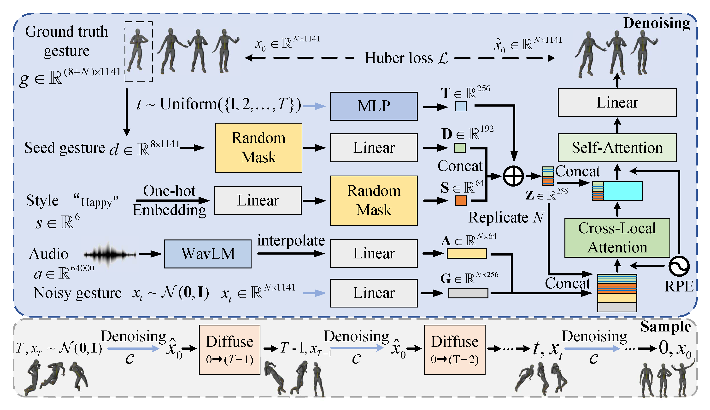

# DiffuseStyleGesture: Stylized Audio-Driven Co-Speech Gesture Generation with Diffusion Models

### [](https://arxiv.org/abs/2305.04919) | [Demo](https://youtu.be/Nzom6gkQ2tM) | [Representation Video](https://youtu.be/IbpxX1xUo64)

<div align=center>

</div>

## Further Work

📢 [QPGesture](https://github.com/YoungSeng/QPGesture) - Based on motion matching, the upper body gesture.

## News

📢 **5/Aug/23** - Release code and pre-trained models of [DiffuseStyleGesture+](BEAT-TWH-main) on BEAT and TWH.

📢 **31/Jul/23** - Upload a [tutorial video](visualize_gesture_using_Blender.md) on visualizing gestures. 

📢 **25/Jun/23** - Upload presentation video.

📢 **9/May/23** - First release - arxiv, demo, code, pre-trained models on ZEGGS and [issue](https://github.com/YoungSeng/DiffuseStyleGesture/issues/1#issue-1702250404).


## 1. Getting started

This code was tested on `NVIDIA GeForce RTX 2080 Ti` and requires:

* conda3 or miniconda3

```
conda create -n DiffuseStyleGesture python=3.7
conda activate DiffuseStyleGesture
pip install -r requirements.txt 
```

[//]: # (-i https://pypi.tuna.tsinghua.edu.cn/simple)

## 2. Quick Start

1. Download pre-trained model from [Tsinghua Cloud](https://cloud.tsinghua.edu.cn/f/8ade7c73e05c4549ac6b/) or [Google Cloud](https://drive.google.com/file/d/1RlusxWJFJMyauXdbfbI_XreJwVRnrBv_/view?usp=share_link)
and put it into `./main/mydiffusion_zeggs/`.
2. Download the [WavLM Large](https://github.com/microsoft/unilm/tree/master/wavlm) and put it into `./main/mydiffusion_zeggs/WavLM/`.
3. cd `./main/mydiffusion_zeggs/` and run 
```python
python sample.py --config=./configs/DiffuseStyleGesture.yml --no_cuda 0 --gpu 0 --model_path './model000450000.pt' --audiowavlm_path "./015_Happy_4_x_1_0.wav" --max_len 320
```
You will get the `.bvh` file named `yyyymmdd_hhmmss_smoothing_SG_minibatch_320_[1, 0, 0, 0, 0, 0]_123456.bvh` in the `sample_dir` folder, which can then be visualized using [Blender](https://www.blender.org/) with the following result (To visualize bvh with Blender see this [issue](https://github.com/YoungSeng/DiffuseStyleGesture/issues/8) and this [tutorial video](visualize_gesture_using_Blender.md)):


https://github.com/YoungSeng/DiffuseStyleGesture/assets/37477030/2ef7aa70-69e0-4fd9-a551-6b8a5d075d17


The parameter `no_cuda` and `gpu` need to be the same, i.e. the GPU you want to use; `max_len` is the length you want to generate, this parameter should be `0` if you want to generate the whole length; if you want to use your own audio, please refer to [this issue](https://github.com/YoungSeng/DiffuseStyleGesture/issues/8#issuecomment-1620027786) to set the style and intensity you want.


## 3. Train your own model

### (1) Get ZEGGS dataset

Same as [ZEGGS](https://github.com/ubisoft/ubisoft-laforge-ZeroEGGS).

An example is as follows.
Download original ZEGGS datasets from [here](https://github.com/ubisoft/ubisoft-laforge-ZeroEGGS) and put it in `./ubisoft-laforge-ZeroEGGS-main/data/` folder.
Then `cd ./ubisoft-laforge-ZeroEGGS-main/ZEGGS` and run `python data_pipeline.py` to process the dataset.
You will get `./ubisoft-laforge-ZeroEGGS-main/data/processed_v1/trimmed/train/` and `./ubisoft-laforge-ZeroEGGS-main/data/processed_v1/trimmed/test/` folders.

If you find it difficult to obtain and process the data, you can download the data after it has been processed by ZEGGS from [Tsinghua Cloud](https://cloud.tsinghua.edu.cn/f/ba5f3b33d94b4cba875b/) or [Baidu Cloud](https://pan.baidu.com/s/1KakkGpRZWfaJzfN5gQvPAw?pwd=vfuc).
And put it in `./ubisoft-laforge-ZeroEGGS-main/data/processed_v1/trimmed/` folder.


### (2) Process ZEGGS dataset

```
cd ./main/mydiffusion_zeggs/
python zeggs_data_to_lmdb.py
```

### (3) Train

```
python end2end.py --config=./configs/DiffuseStyleGesture.yml --no_cuda 0 --gpu 0
```
The model will save in `./main/mydiffusion_zeggs/zeggs_mymodel3_wavlm/` folder.


<!-- Here is our video. Characters from [here](https://www.mixamo.com/#/?page=2&type=Character).  -->
<!-- https://github.com/YoungSeng/DiffuseStyleGesture/assets/37477030/6ae45c42-2275-422b-b0e7-f291e59646eb -->


## Reference
Our work mainly inspired by: [MDM](https://github.com/GuyTevet/motion-diffusion-model), [Text2Gesture](https://github.com/youngwoo-yoon/Co-Speech_Gesture_Generation), [Listen, denoise, action!](https://arxiv.org/abs/2211.09707)

## Citation
If you find this code useful in your research, please cite:

```
@inproceedings{yang2023DiffuseStyleGesture,
  author       = {Sicheng Yang and Zhiyong Wu and Minglei Li and Zhensong Zhang and Lei Hao and Weihong Bao and Ming Cheng and Long Xiao},
  title        = {DiffuseStyleGesture: Stylized Audio-Driven Co-Speech Gesture Generation with Diffusion Models},
  booktitle    = {Proceedings of the 32nd International Joint Conference on Artificial Intelligence, {IJCAI} 2023},
  publisher    = {ijcai.org},
  year         = {2023},
}
```

Please feel free to contact us ([yangsc21@mails.tsinghua.edu.cn](yangsc21@mails.tsinghua.edu.cn)) with any question or concerns.
