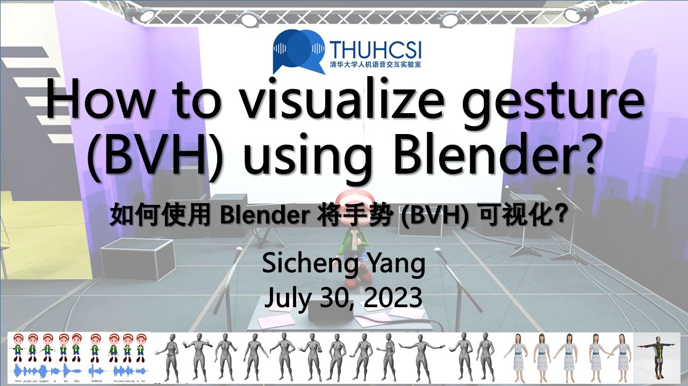

# How to visualize gesture (BVH) using Blender?

This is a video demo of using Blender to visualize 3D gestures.

 | 

You can download the relevant files and plug-ins in the video from [Google Cloud](https://drive.google.com/drive/folders/1etGBapb5F0D9lJ-n8EymUFGINBrr8mNy?usp=sharing) or [Baidu Cloud](https://pan.baidu.com/s/1BctNx7db1k9RTFInsR7OvQ?pwd=t49z).

------------------------------------------------------------

You can visualize the results of the BEAT dataset (i.e., DiffuseStyleGesture+), with the tutorial above.
If you want to visualize the results of the ZEGGS dataset (i.e., DiffuseStyleGesture), you will need to perform an additional step because the initial position of the skeleton for ZEGGS is not a T-pose, as shown at approximately `13:17` in the video. [[See this issue](https://github.com/YoungSeng/DiffuseStyleGesture/issues/25)]
1. With the rendering code [provided by Ubisoft](https://github.com/ubisoft/ubisoft-laforge-ZeroEGGS#rendering), after you run the `BVH2FPX` code it provides you get a new `fpx` file, import it into Blender with the `better FPX importer plugin` (Provided in the link above) and you can continue with the skeleton retargeting as in the tutorial. I would suggest that you can download and install `Motionbuilder` version 2020 as this gives new users a month of free use.
2. There is another way to utilize `Maya` and manually set the initial position of the generated result to the T-pose, but this method is a bit more troublesome and difficult, I can record another tutorial sometime afterward, and I would recommend using the first method.

